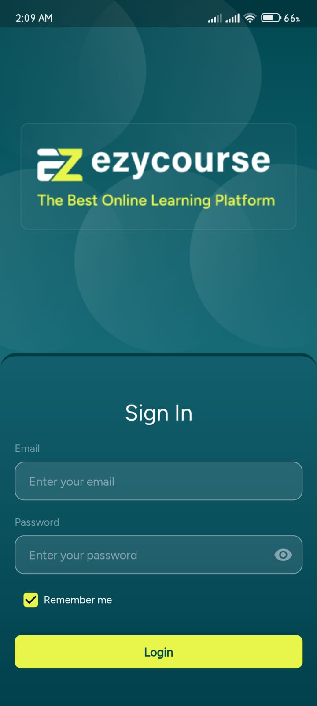
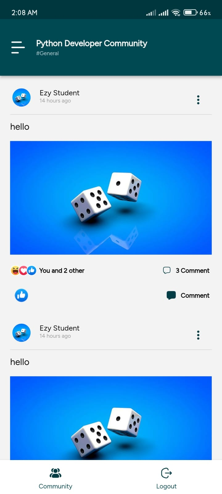
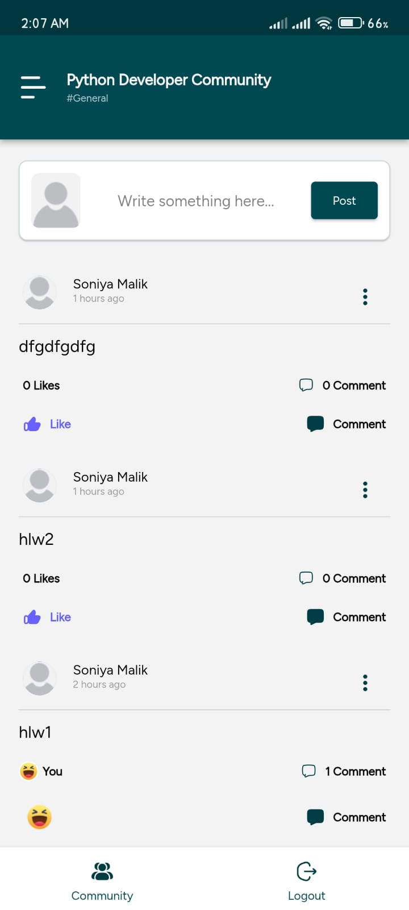
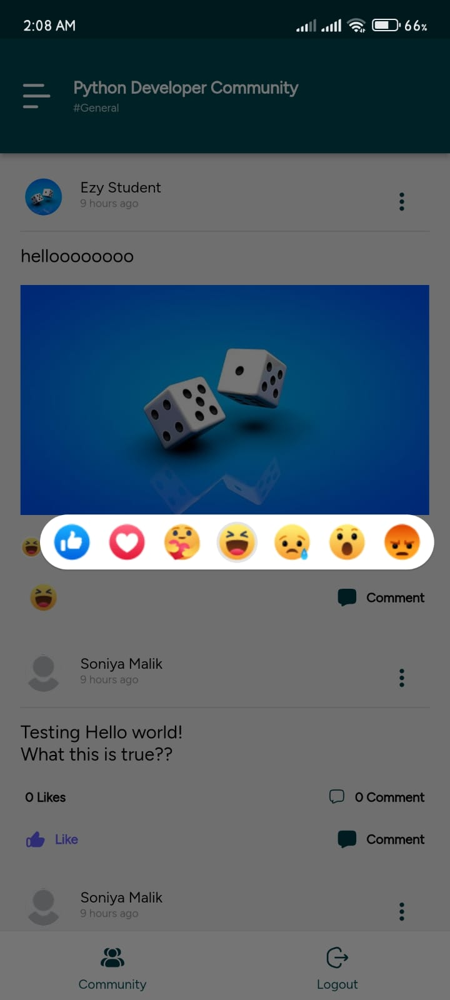
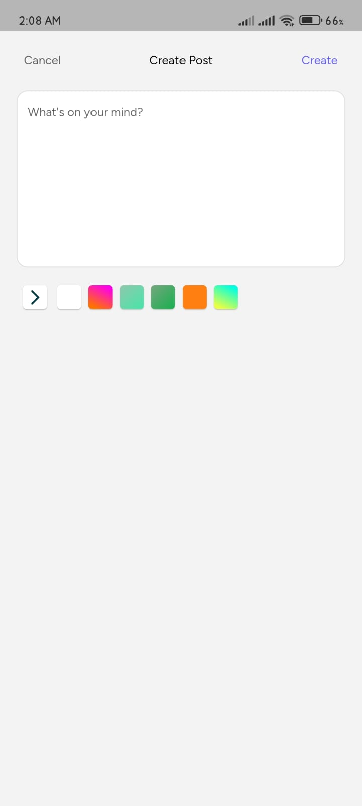
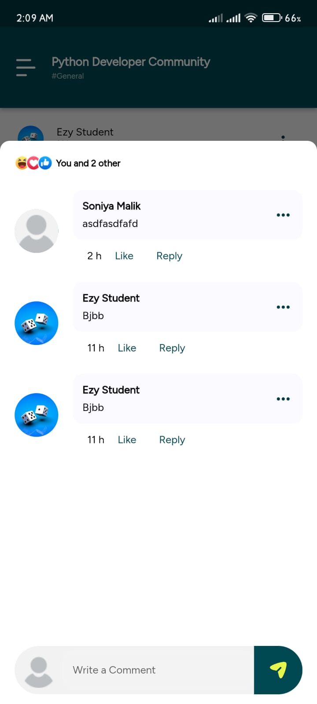
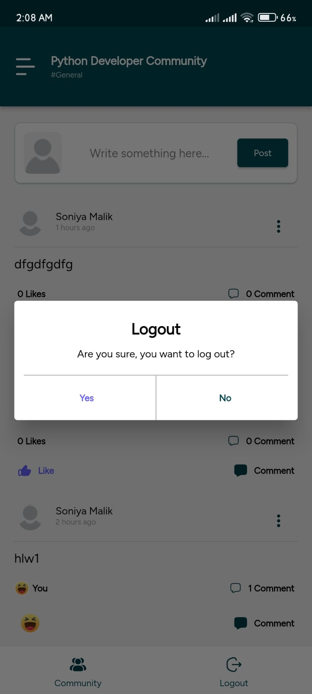

# ezyCourse

ezyCourse is a simple course app made with Flutter. It lets you browse and create posts with smooth animations. The app is built with clean code that's easy to update and maintain.

---

## Features

### Core Features
1. **Authentication**
   - **Login**: Users can authenticate via the login screen using their credentials.
   - **Logout**: Users can securely log out, clearing session data and navigating to the login screen.

2. **Feed Functionalities**
   - **Dynamic Feed**: Fetches posts dynamically from the provided API and displays them in a scrollable list.
   - Each post includes:
     - User Name and Profile Picture
     - Post Content (text or image)
     - Reactions
     - Post Time

3. **Post Creation**
   - Users can create new posts with or without background themes.
   - Newly created posts are sent to the API and instantly appear in the feed.

4. **Reactions and Interactivity**
   - Users can react to posts with options like "like" and "love."
   - Reaction counts update dynamically.

5. **Comments and Replies**
   - Users can add comments under any post.
   - Collapsible sections display all comments.
   - Nested replies allow for seamless discussions under comments.

---

## Architecture

ezyCourse is implemented using **Clean Architecture**. The app is organized into distinct layers:
- **Presentation/Feature Layer**: Handles UI components, utilizing ViewModels for state management.
- **Domain Layer**: Encapsulates business logic with use cases.
- **Data Layer**: Manages data operations, including API integration and local storage.

This structure ensures:
- Clear separation of concerns.
- Scalability for future enhancements.
- Easier debugging and testing.

---

## Setup and Installation

### Prerequisites
- **Flutter**: Install the latest stable version of Flutter from [flutter.dev](https://flutter.dev).
- **API Access**: Ensure access to the provided API documentation.

### Steps to Run
1. Clone the repository:
   ```bash
   git clone https://github.com/Hippopop/ezy_course_app
   cd ezyCourse
   ```
2. Get dependencies:
   ```bash
   flutter pub get
   ```
3. Run the app:
   ```bash
   flutter run
   ```
   > Note: Use `flutter build apk` to generate an APK for Android deployment.

---

## Design Decisions

1. **Clean Architecture**: Ensures modularity and testability.
2. **Real-time Updates**: Dynamically updates feed and reactions for a smooth user experience.

---

## Deliverables

- [Android APK](/installables/APK/EzCourseApp.apk)
- GitHub repository: [ezyCourse Repo](https://github.com/Hippopop/ezy_course_app)
- Compatible with both Android and iOS.

---

## References

- [Figma Design](https://www.figma.com/design/0NudwHKVSL2egvlbicdGYH/Test-Appifylab?node-id=442-2034&p=f&t=MZ5TOPzmgPYN0UmW-0)
- [API Documentation](https://docs.google.com/document/d/1tnxEbZ9z223FG9CgYZFGP2ImYXheSUWtE9tNcQtLGkE/edit?usp=sharing)

---

## Screenshots
|  |  |  |
| :------------------------------------------: | :------------------------------------------: | :------------------------------------------: |
|  |  |  |
|                Thank You! 💙✨                 |  |                 Much Love! 💕                 |


